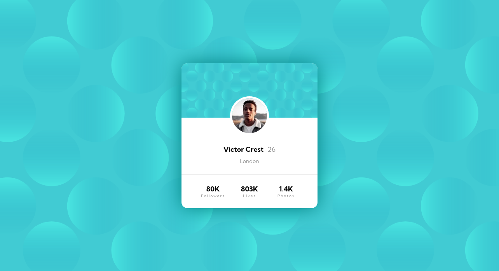

# Profile Card Component

> A challenge from Frontend Mentor

## Table of contents

- [Overview](#overview)
- [My process](#my-process)
- [Author](#author)

## Overview

Profile Card Component is a  challenge from Frontend Mentor, where the purpose
is to create a stylized card with a photo, name and other informations of a user,
which automatically adapts to the size of the browser window.

Want to see it live? Check it out on the Environment section, or click [here!](https://rafael-holanda.github.io/profile-card-component/)

Or, do you want to check the challenge page? Click [here!](https://www.frontendmentor.io/challenges/profile-card-component-cfArpWshJ)

## My process

This project was made with the [replit.com](https://replit.com) IDE, where I used basic HTML and CSS.

Working on this project I was able to better develop my CSS skill, and with this
project done, I want to continue developing my front-end skills.

## Author

- Frontend Mentor - [@rafael-holanda](https://www.frontendmentor.io/profile/rafael-holanda)
- Twitter - [@rafinholanda](https://twitter.com/rafinholanda)
